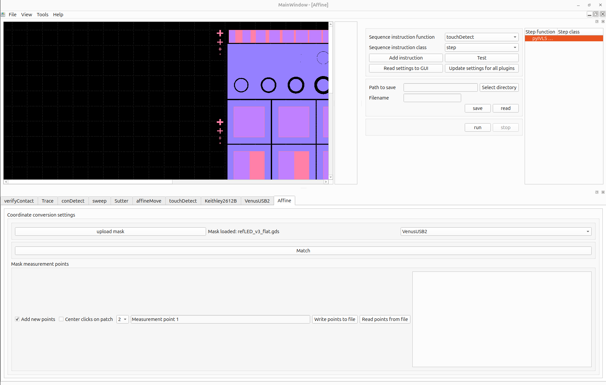
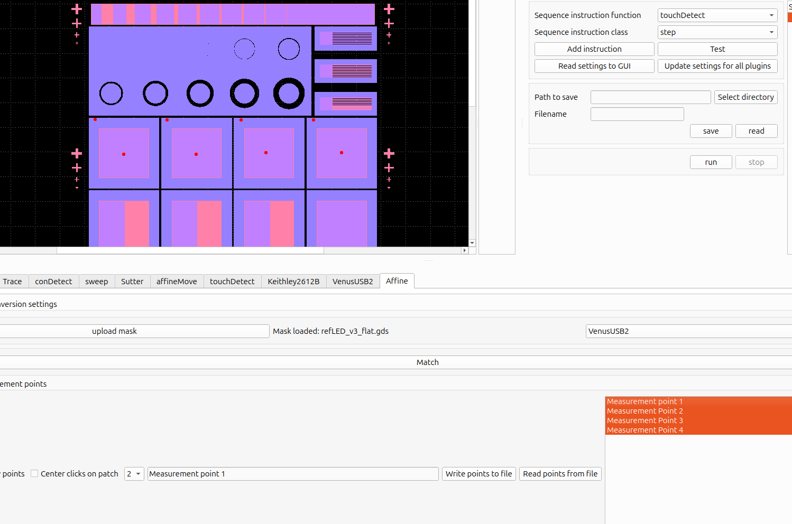
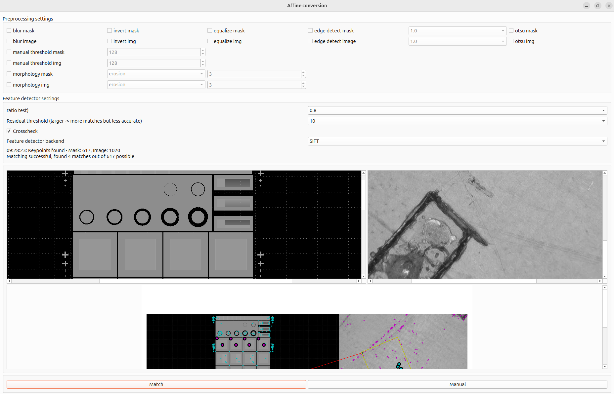
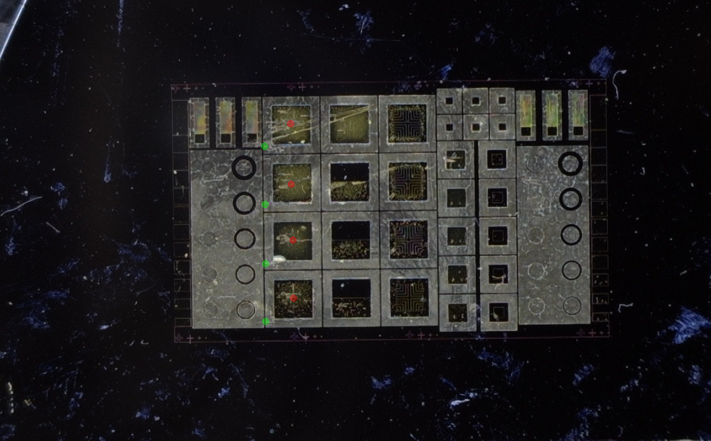
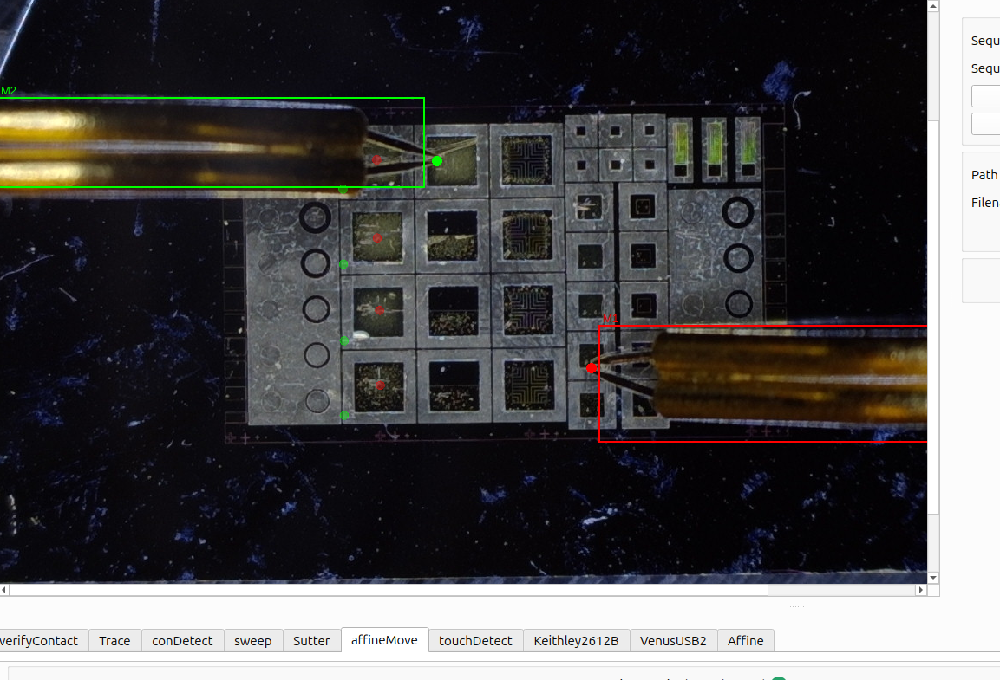
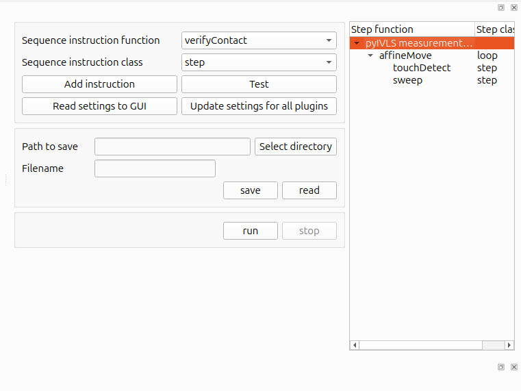

# Running a sweep on a series of points
TODO: update instructions
## Turn on hardware
- switch wired connection to keithley if running through ETH

## Enable needed plugins

## Setting measurement points
- Upload mask through the Affine settings widget. The mask can be previewed on the affine MDI-Widget. Mask can be a .gds file or a screenshot from the mask as an image.
- Add the measurement points on the mask image.  the checkbox for "add new points" enables adding new measurement points, "center click on patch" sets the measurement at the center of the clicked component, the number combobox sets the number of contact points for that measurement. "write/read" buttons read predefined measrurements points from .csv files. Highlighting the defined points in the list view previews them on the mask image.
- The points are added in order of manipulator. The first point is the location of manipulator 1 and so on.

##  Coordinate conversion
- Click on the "match" button, it opens the conversion dialog . The two top images show the mask and the image after preprocessing. The bottom image shows the generated coordinate transformation to be visually checked. 
- Preprocessing settings: The goal is to get the images looking fairly similar. Good options include edge detection for both the mask and image, otsu's thresholding for both or blurring the mask slightly and the image more. (Histogram) equalization sometimes help in bringing out detail from the mask while thresholding or edge detection.
- The "match" runs automatic matching, the manual mode starts a loop to define 4 points in both images. select 4 points on the mask and then the corresponding 4 points on the image in order.
- Once a match is found and visually inspected, closing the dialog saves the current conversion.

## affineMove Setup
- switch to the affineMove settings tab: 
- Click on "fetch positioning data" and "preview camera" to fetch the measurement points from the affine Plugin and to start the preview on the MDI-Widget.  The user can check again if the defined points and transform looks correct.
- Locating the micromanipulators is done by either loading the last calibration from file (Useful when the camera is truly stable and has not moved since the last measurement) or redefining the calibration through the "locate manipulator" button.
- The location loop guides the user through popups. Some tips:
    1. The automatic loop moves the manipulators in the x - y directions and the user clicks on the tip. It is best to move the manipulator as close as possible to the sample so that the location actually matches the location when the manipulator is down. 
    2. Don't push the manipulator on the sample, as the automatic move routine only pulls up for 100 micron when changing position.
- After all manipulators have been calibrated, the calibration should be saved. 
- The bounding boxes groupbox defined a box in relation to the tip location that is used for collision calculations. These rarely have to be updated. Refresh positions -button queries the current location of the manipulators and updates the preview. 

## touchdetect setup
- Open touchdetect tab 
- "initialize dependences" to query needed plugins 
- Set the smu channel, con channel and resistance cutoff for used manipulators. None leaves the manipulator unconfigured and unused.
- Start monitoring. This starts the loop to manually find the contact point for all defined manipulators.
- Touchdetect is setup once all manipulators are contacted.

## (verifyContact setup)
- Verifycontact uses the interface provided by touchDetect, and just needs the correct dependency setting.

## Sweep setup
- set the sweep settings on the sweep tab. 

## Sequence builder

- Create the measurement sequence and run. 

## To speed up setup:
- save the settings to file
- create a copy of the ini file to run a sweep to quickly load the necessary plugins with the load config button in the top left